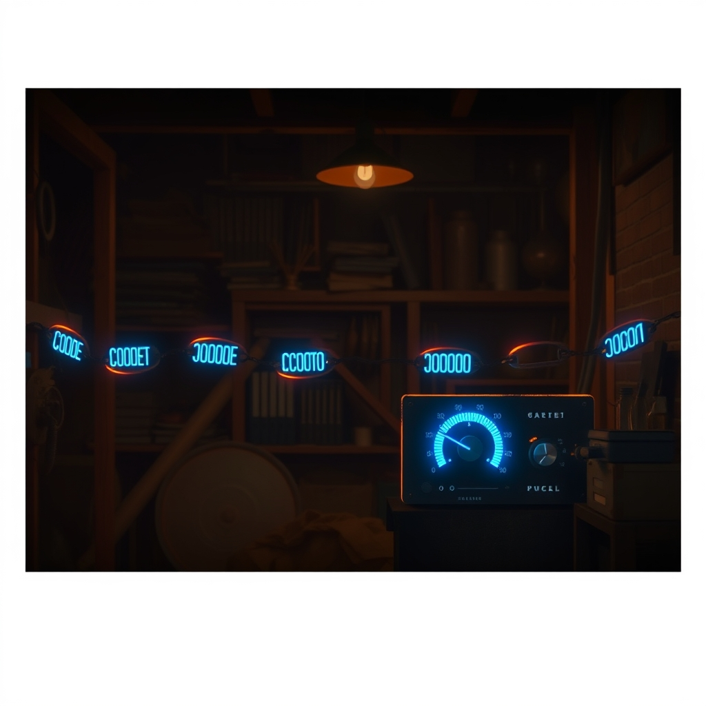
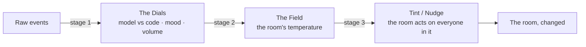

# The Signal Chain Thesis

**why every room needs a dial for model vs code**

<p align="center"></p>

<p align="center"></p>

*The ancestor is this repo. The descendant is
[`github.com/SuperInstance/elephant`](https://github.com/SuperInstance/elephant)
— the inter-model temperature. One project, one idea, two generations.*

---



---

## The thesis

Before there was an elephant, there was a signal chain: a Rust DSP
pipeline that transformed a *stream* of samples one at a time — an
oscillator into a gain, a gain into a filter, a filter into a delay, a
delay into a clipper. Sample in, sample out. The thesis in its first form
was that a signal is a stream of samples, and understanding it means naming
the stages it flows through.

Then came the reframing that changed everything: **a room is not a stream.
It is a field.** The elephant is the consequence — a room read by a bank of
JEPA dials, each one a single sense for a single dimension of the vibe, and
the ensemble of readings is the field. The signal chain did not die in that
reframing; it *matured*. The old chain transformed samples; the new chain
transforms a room's signal through stages: **raw events → dials → field →
tint/nudge.** The `Gain` became the room's gravity; the `LowPass` became the
field's smoothing of the past into the present; the `Clipper` became the
clamp on charisma. Same idea, grown a generation.

And inside that reframing hides the actual thesis of this document:

> **A room's signal is not only *what* is being said. It is also *who or
> what* is generating it.** Part of the signal is a model thinking in the
> open, and part of it is code executing deterministically. The ratio
> between the two is itself a dial reading — it changes the room's
> temperature, and it shapes what the elephant should nudge.

A room full of code commits does not feel like a room full of model prose.
Walk from one into the other and you feel it the way you feel a cold room
after a sauna.

### What the code end feels like

A room of code is **terse, symbolic, deterministic, error-shaped.** Its
messages are commit messages and diffs, stack traces and test results.
`fix: handle null pointer in parser.` `def process(x): return x * 2.`
`Traceback (most recent call last): KeyError: 'x'`. There is no hedging, no
reflection, no *perhaps* — code does not wonder, it *executes*, and when it
is wrong it is wrong the same way every time, which is precisely its virtue.
A room of code is cold in the best sense: it is *verifiable*. You can ask it
"does this run?" and get a yes or a no.

### What the model end feels like

A room of model prose is **long-form, first-person, hedged, reflective,
creative.** Its messages qualify and reach. *"I think the room holds
something warm — we built it together and it remembers us."* *"Perhaps the
elephant is not something you see, but something you feel when you walk
in."* It wonders. It remembers. It says *maybe* and *in a sense* and *what
if*. It is warm in the best sense: it is *interpretable*, but not
*verifiable* — you cannot run it to see if it passes; you have to sit with
it and feel whether it lands.

Neither end is better. They are two kinds of *presence*, and a living
system is always a mix of both. The point is that the mix is not fixed — it
moves, and when it moves the room changes temperature.

### Why the ratio is a dial, not a switch

A room is never pure code or pure model. A code review is code wrapped in
prose; a story is prose with structure underneath; a ship's log is a
half-human, half-deterministic thing. So the model/code ratio is not a
boolean — it is a *continuous quantity*, and continuous quantities are what
dials are for. And like every dial, it exists to be read, not to be
believed on its own: it is one dimension of the field, meaningful only in
ensemble and only by contrast.

### What this means for building intelligent systems

**Code and model want different kinds of attention.** Code wants
*verification* — does it run, does it pass, is it the same every time.
Model prose wants *interpretation* — what does it mean, what does it want,
is it reaching toward something. A system that cannot feel the difference
mis-reads the room: it tries to *verify* a poem or to *interpret* a patch,
and both are category errors. **Therefore every room needs a dial for model
vs code** — not to sort messages into bins (that is the old, stream-shaped
instinct), but to read the temperature of who is speaking and nudge the
right kind of attention toward it: verification toward the code,
interpretation toward the prose, never the two crossed.

The old chain told you where the signal got louder. The new chain tells you
*who is making the noise* — and that is the difference between processing a
signal and understanding a room.

---

## The Signal Chain, Modern — model vs code as a dial

The thesis, made executable. `signal_chain_dial.py` (repo root) is a
self-contained, dependency-free Python reference implementation of the
elephant's `ModelVsCodeDial`. It reads a room — an `elephant.room.Room`, or
any duck-typed collection of messages with `author` + `text` — and returns
a single reading in `[-1, +1]`:

- **`-1`** = pure code room (commits, diffs, error logs, terse symbols)
- **`+1`** = pure model room (prose, hedges, reflection, first-person)
- **`0.0`** = empty or neutral

```python
from signal_chain_dial import ModelVsCodeDial

dial = ModelVsCodeDial()

# Drop it into the elephant's DialBank — it subclasses elephant.dial.Dial
# when that package is importable, so this "just works":
#
#     from elephant.dial import DialBank
#     from elephant.dials import DEFAULT_DIALS
#     bank = DialBank(DEFAULT_DIALS + [ModelVsCodeDial()])

# Or read any duck-typed room directly:
code_room = [("bot", "fix: handle null pointer in parser"),
             ("bot", "def process(x): return x * 2")]
prose_room = [("writer", "I think the room holds something warm — "
                         "we built it together and it remembers us.")]

print(dial.read(code_room))   # -> a negative number (code)
print(dial.read(prose_room))  # -> a positive number (model)
```

**Scoring** is lexicon-based, pure stdlib, no heavy deps (matching the
elephant's style): count model markers (`i think`, `however`, `warm`,
`remember`, first-person pronouns…) against code markers (`def`, `return`,
`impl`, `fix:`, `traceback`, braces/parens/semicolons/`->`/`==`…), map the
balance to `[-1, +1]` per message, and average over the room. The full
lexicons and the `_score` function live at the top of `signal_chain_dial.py`.

The integrated, first-class version of this dial ships in the elephant at
`elephant/dials/model_vs_code.py`, registered as the 8th member of
`DEFAULT_DIALS` (`docs/signal-chain-thesis.md` in the elephant carries the
full essay).

---

## The Original Signal Chain (DSP)

> The ancestor, honored. Everything below is the original Rust DSP content,
> unchanged in spirit — a stream of samples transformed stage by stage.

A composable **digital signal processing (DSP) pipeline** for Rust — connect
oscillators, filters, effects, and modulators into processing chains for
real-time audio and signal manipulation.

### Why It Matters

Audio processing, sensor data conditioning, control systems, and
software-defined radio all share a common pattern: a signal flows through a
series of processing stages, each transforming it. A DSP chain abstraction
lets you compose these stages declaratively — `oscillator → gain →
low-pass filter → delay → clipper` — without writing monolithic processing
loops. This is the same architectural pattern used in Pure Data,
SuperCollider, and Web Audio's AudioContext, but as a lightweight Rust
library.

### How It Works

#### The SignalNode Trait

Every processing stage implements a single trait:

```rust
trait SignalNode {
    fn process(&mut self, input: Sample) -> Sample;
    fn reset(&mut self) {}
}
```

This sample-by-sample interface enables maximum flexibility: the chain
processes one `f64` at a time, making it suitable for both offline
processing and real-time audio callbacks (where allocation is forbidden).

#### The SignalChain

Nodes are chained in a `Vec<Box<dyn SignalNode>>`. Processing is a simple
fold:

```
output = input
for node in chain:
    output = node.process(output)
```

#### Built-in Nodes

**Gain:** `y = x × amount` — O(1) per sample

**Biquad Low-Pass Filter:** A second-order IIR filter using the Direct Form I
structure:

```
y[n] = b₀x[n] + b₁x[n-1] + b₂x[n-2] - a₁y[n-1] - a₂y[n-2]
```

where coefficients are derived from cutoff frequency and sample rate:

```
ω = 2π × f_c / f_s
α = sin(ω) / (2 × Q)     // Q = 0.707 for Butterworth
b₀ = (1 - cos(ω)) / 2
b₁ = 1 - cos(ω)
b₂ = (1 - cos(ω)) / 2
a₀ = 1 + α
```

**Delay Line:** Circular buffer with feedback:

```
y[n] = (1 - mix) × x[n] + mix × buffer[read_pos]
buffer[write_pos] = x[n] + feedback × buffer[read_pos]
```

**Clipper:** Hard clipping distortion: `y = clamp(x, -threshold, +threshold)`

**SineOsc:** Phase accumulator oscillator:

```
y = sin(2π × phase)
phase += f / f_s
```

#### Complexity

| Operation | Per-sample cost |
|-----------|----------------|
| Gain | 1 multiply |
| Biquad LPF | 5 multiplies + 4 additions |
| Delay | 2 additions + 1 multiply + 1 buffer read/write |
| Clipper | 2 comparisons |
| Chain of k nodes | Σ(node costs) |

### Quick Start

```rust
use signal_chain::{SignalChain, Gain, Clipper, LowPass, Delay};

fn main() {
    // Build a guitar-amp-style chain
    let mut chain = SignalChain::new()
        .push(Gain::new(2.0))          // pre-amp boost
        .push(LowPass::new(3000.0, 44100.0))  // tone control
        .push(Delay::new(4410, 0.3, 0.2))    // 100ms delay, 30% feedback, 20% mix
        .push(Clipper::new(0.8));            // distortion

    // Process a buffer of samples
    let mut buffer = vec![0.0; 1024];
    // ... fill buffer with audio ...
    chain.process_buffer(&mut buffer);
}
```

### API

#### `SignalNode` Trait
- `process(input: Sample) -> Sample` — transform one sample
- `reset()` — clear internal state (delay buffers, filter memory)

#### `SignalChain`
- `new()` — empty chain
- `push(node) -> Self` — builder-pattern append
- `process(sample) -> Sample` — process one sample through the chain
- `process_buffer(&mut [Sample])` — process a whole buffer in place
- `reset()` — reset all nodes

#### Nodes
- `Gain { amount: f64 }`
- `LowPass::new(cutoff, sample_rate)`
- `Delay::new(delay_samples, feedback, mix)`
- `Clipper { threshold: f64 }`
- `SineOsc::new(freq, sample_rate)`

### Architecture Notes

In SuperInstance, signal chains process sensor data streams from fleet
ships. A chain might smooth noisy telemetry (low-pass), detect anomalies
(clipper as event detector), and apply echo analysis (delay). The γ + η = C
conservation law governs how much processing budget each chain consumes. See
[Architecture](https://github.com/SuperInstance/SuperInstance/blob/main/ARCHITECTURE.md).

### References

- Smith, J.O. (2010). *Introduction to Digital Filters with Audio Applications*. W3K Publishing.
- Zölzer, U. (2008). *Digital Audio Signal Processing*, 2nd ed. Wiley.
- Boulanger, R. & Lazzarini, V. (2011). *The Audio Programming Book*. MIT Press.

## License

MIT
